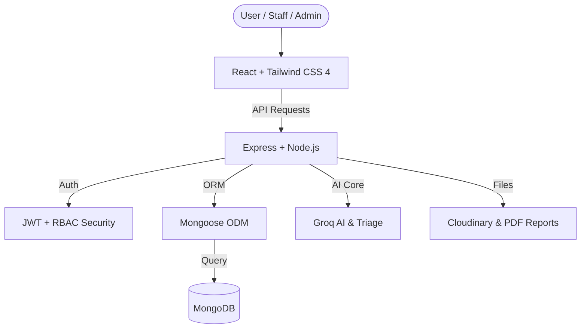

# 🏥 OrvantaHealth — Enterprise Hospital Management System

[](LICENSE)
[](http://makeapullrequest.com)
[](https://www.mongodb.com/mern-stack)
[](https://groq.com/)

OrvantaHealth is a production-ready, feature-rich **Hospital Management System (HMS)** engineered with the **MERN stack** (MongoDB, Express, React, Node.js). It is designed to modernize hospital administration, empower medical professionals with AI-driven diagnostics, and deliver a frictionless patient experience through secure digital portals and automated workflows.

---

## 🏗 Architecture Overview

The system follows a decoupled **Client-Server architecture** with a modular backend and a component-driven frontend.



---

## 🌟 Key Features

### 🔐 Enterprise-Grade RBAC
- **Super Admin**: Centralized command center for managing hospital branches, staff, audit logs, and global analytics.
- **Doctors**: Advanced portal for digital prescriptions, patient history lookup, and appointment management.
- **Receptionists**: Streamlined workflows for front-desk operations: billing, lab report uploads, and scheduling.
- **Patients**: Self-service portal for appointment booking, instant payments, and secure access to medical records.

### 🧠 AI-Driven Healthcare (Triage & Assistant)
- **AI Triage System**: Uses **Groq LLaMA 3.3-70B** to analyze symptoms and vitals, providing a risk score (0-100) for emergency prioritization.
- **24/7 AI Medical Assistant**: A specialized chatbot for medical FAQs and hospital guidance, strictly sanitized for safety.
- **Automated Risk Assessment**: Real-time triage flags high-priority patients for immediate clinical attention.
- 🔗 [Read the AI Architecture Guide](./ai_symptom_checker_architecture.md)

### 💳 Financials & Documentation
- **One-Click Payments**: Deep integration with **Razorpay** for seamless appointment and billing transactions.
- **Automated Billing Engine**: Dynamic receipt generation (PDF) with persistent payment history tracking.
- **Secure Cloud Storage**: Medical documents and lab reports are encrypted and stored via **Cloudinary**.

### 📊 Professional Analytics
- **SuperAdmin Dashboard**: High-fidelity charts (Recharts) visualizing revenue, department load, and patient trends.
- **Audit Ready**: Comprehensive data logging for compliance and operational auditing.
- 🔗 [Read the SuperAdmin Module Guide](./SUPERADMIN_FEATURES.md)

---

## 🛠 Tech Stack

### Frontend
- **React 19 & Vite**: Ultra-fast component rendering and HMR.
- **Tailwind CSS 4**: Modern utility-first styling with high performance.
- **React Hook Form**: Zod-validated, performant form handling.
- **Lucide React**: Clean, semantic iconography.
- **Recharts**: Responsive data visualization.

### Backend
- **Node.js 20+ & Express 5**: Modern, asynchronous API architecture.
- **MongoDB & Mongoose**: Scalable NoSQL persistence with schema validation.
- **JWT & Passport**: Secure authentication with Refresh Token rotation.
- **Groq SDK**: High-performance LLM integration for AI features.
- **Cloudinary / Multer**: Robust handling of medical media and assets.

---

## 🚀 Getting Started

### Prerequisites
- **Node.js** (v20.x recommended)
- **MongoDB** (Local instance or Atlas Cluster)
- **Groq API Key** (Sourced from [Groq Cloud](https://console.groq.com/))
- **Razorpay API Key** (Available on [Razorpay Dashboard](https://dashboard.razorpay.com/))

### 1. Installation
```bash
# Clone the repository
git clone https://github.com/ksingla1885/OrvantaHealth.git
cd OrvantaHealth

# Setup Backend
cd backend && npm install

# Setup Frontend
cd ../frontend && npm install
```

### 2. Environment Configuration
Create a `.env` file in the `backend/` directory:
```env
PORT=5000
MONGODB_URI=your_mongodb_connection_string
JWT_SECRET=your_jwt_secret
JWT_REFRESH_SECRET=your_refresh_secret
RAZORPAY_KEY_ID=your_razorpay_id
RAZORPAY_KEY_SECRET=your_razorpay_secret
GROQ_API_KEY_PRIMARY=your_groq_api_key
CLOUDINARY_CLOUD_NAME=your_cloud_name
CLOUDINARY_API_KEY=your_cloudinary_key
CLOUDINARY_API_SECRET=your_cloudinary_secret
EMAIL_SERVICE=gmail
EMAIL_USER=your_email@gmail.com
EMAIL_PASS=your_app_password
```

### 3. Execution
**Development Mode:**
```bash
# Terminal 1: Backend
cd backend && npm run dev

# Terminal 2: Frontend
cd frontend && npm run dev
```

---

## 📁 Project Structure

```text
OrvantaHealth/
├── backend/
│   ├── config/          # Database, Passport, & Multi-Cloud configs
│   ├── controllers/     # Controller logic (Auth, Appointment, Triage)
│   ├── middleware/      # Auth (JWT/RBAC), Error Handlers, File Uploads
│   ├── models/          # Mongoose Schemas (User, Patient, Report, etc.)
│   ├── routes/          # Express Route definitions
│   ├── services/        # Third-party integrations (AI, Payments, Mailer)
│   └── utils/           # Helper functions & constants
├── frontend/
│   ├── src/
│   │   ├── components/  # Atomic & Shared UI Components
│   │   ├── context/     # Global State (Auth, UI, Theme)
│   │   ├── pages/       # Route components (Dashboards, Auth, Landing)
│   │   ├── services/    # API abstraction layer (Axios interceptors)
│   │   └── assets/      # Global styles & static assets
└── docs/                # Comprehensive technical documentation
```

---

## 🛡 Security & Compliance
- **RBAC Enforcement**: Granular access control for SuperAdmins, Doctors, and Staff.
- **Data Integrity**: JWT fingerprinting and protection against XSS/CSRF.
- **Secure Pay**: Encrypted payment processing via Razorpay.
- **Medical Privacy**: HIPAA-aligned data handling strategies (work in progress).

---

##  License
Distributed under the MIT License. See [LICENSE](LICENSE) for more information.

---

<p align="center">
  <b>Built with ❤️ by Ketan</b><br/>
  <i>Modernizing Healthcare, One Patient at a Time.</i>
</p>

