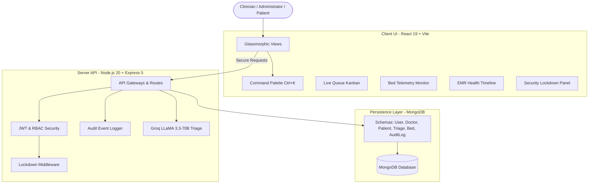

# 🏥 OrvantaHealth — Enterprise Hospital Management System

[](LICENSE)
[](http://makeapullrequest.com)
[](https://www.mongodb.com/mern-stack)
[](https://groq.com/)
[](https://react.dev/)
[](https://tailwindcss.com/)

OrvantaHealth is a production-ready, high-fidelity **Hospital Management System (HMS)** built with the **MERN stack** (MongoDB, Express, React, Node.js). It modernizes healthcare administration, streamlines clinical triage using advanced AI, monitors live hospital bed telemetry, and ensures rigorous compliance with real-time audit trails and emergency lockdown mechanisms.

---

## 🏗 System Architecture

The application is built on a decoupled **Client-Server architecture** with a modular backend API, security-focused middlewares, and an interactive, glassmorphic React frontend.



---

## 🌟 Key Features

### 🔐 Enterprise-Grade RBAC & Security Control
- **Dynamic Permission Grid**: Role-based access controls separating clinical, administrative, and patient dashboards.
- **Emergency Lockdown System**: A global panic mechanism for SuperAdmins that immediately blocks non-essential API endpoints, terminates standard staff sessions, and activates a visual red-state warning overlay across the UI.
- **Compliance Audit Logging**: Comprehensive, tamper-resistant system ledger logging all administrative operations (account toggles, offboarding, bed updates, lockdowns) complete with severity level, operator identity, IP addresses, and custom descriptions.

### 🧠 AI-Driven Symptom Analysis & Intake
- **Groq LLaMA 3.3-70B Integration**: Dynamically evaluates patient symptoms and vitals during triage to compute clinical risk scores (0-10) and identify possible medical conditions.
- **24/7 AI Medical Assistant**: A built-in context-aware medical chatbot designed to handle patient inquiries and navigate hospital options safely.

### 📋 Live Interactive Triage & Kanban Queue
- **Intake Flow Management**: Seamless patient registration and instant AI risk scoring.
- **Live Queue Kanban Board**: A drag-and-drop workspace that visualizes patient pathways through the hospital workflow: `Pending` ➔ `Referred` ➔ `In-Consultation` ➔ `Completed`.
- **Roster & Status Hygiene**: Clinicians can check-in and check-out patients directly from their consultation rooms, automatically synchronizing queue states across receptionist and doctor views.

### 🏥 Longitudinal EMR & Patient Record Continuity
- **Medical Record Number (MRN) Registry**: Generates unique, immutable identity anchors for every patient to prevent duplicate chart creation.
- **Unified Clinical Timeline**: Automatically aggregates prescriptions, triage records, lab reports, appointments, and invoices into a single sorted chronological history feed.
- **Returning Patient Intelligence**:
  - Displays vitals comparison trends (Current vs. Last Intake) side-by-side.
  - Features an **Automatic Recall Card** displaying exactly what the current physician treated the patient for during their previous visit.
  - Highlights missed follow-up appointments and active clinical alerts (e.g., allergies, chronic diseases).

### 📊 Real-Time Bed Telemetry & Analytics
- **Live Bed Capacity Telemetry**: High-fidelity dashboard visualizing total, occupied, and available general/ICU beds across different hospital departments.
- **Operational Analytics**: Rich data visualization charts (using Recharts) representing historical revenue trends, department load distributions, and staff consulting throughput.

### ⌨ Universal Command Palette
- **Rapid Keyboard Access**: Hit `Ctrl+K` or `Cmd+K` from anywhere in the application to trigger a global command bar.
- **Smart System Search**: Search patients, navigate to dashboards, trigger lockdown options, or log out instantly without lifting your hands from the keyboard.

---

## 🛠 Tech Stack

### Frontend Client
- **React 19 & Vite**: Component rendering with fast Hot Module Replacement.
- **Tailwind CSS 4**: High-performance, modern utility-first styles.
- **React Hook Form & Zod**: Schema-validated forms.
- **Lucide React**: Vector icons.
- **Recharts**: Responsive data visualization.

### Backend Server
- **Node.js 20+ & Express 5**: Asynchronous routing.
- **MongoDB & Mongoose**: Object modeling with schema-level validation.
- **JWT & Passport**: Secure stateless authorization.
- **Groq SDK**: Cloud-based LLaMA models for instant triage.
- **Razorpay**: Direct API integration for financial transactions.
- **Cloudinary / Multer**: Digital prescription receipt archiving.

---

## 🚀 Getting Started

### Prerequisites
- **Node.js** (v20.x or higher)
- **MongoDB** (Local instance or Atlas Cluster)
- **Groq API Key** (Sourced from [Groq Cloud](https://console.groq.com/))
- **Razorpay API Key** (Available on [Razorpay Dashboard](https://dashboard.razorpay.com/))

### 1. Installation
```bash
# Clone the repository
git clone https://github.com/ksingla1885/OrvantaHealth.git
cd OrvantaHealth

# Install Backend Dependencies
cd backend && npm install

# Install Frontend Dependencies
cd ../frontend && npm install
```

### 2. Environment Configuration
Create a `.env` file in the `backend/` directory:
```env
PORT=5000
MONGODB_URI=your_mongodb_connection_string
JWT_SECRET=your_jwt_secret
JWT_REFRESH_SECRET=your_refresh_secret
RAZORPAY_KEY_ID=your_razorpay_id
RAZORPAY_KEY_SECRET=your_razorpay_secret
GROQ_API_KEY_PRIMARY=your_groq_api_key
CLOUDINARY_CLOUD_NAME=your_cloudinary_name
CLOUDINARY_API_KEY=your_cloudinary_key
CLOUDINARY_API_SECRET=your_cloudinary_secret
EMAIL_SERVICE=gmail
EMAIL_USER=your_email@gmail.com
EMAIL_PASS=your_app_password
```

### 3. Seeding Test Records
To initialize the system with mock users and clinical records, run the following utility scripts:
```bash
# In the backend directory:

# Seed default SuperAdmin (admin@orvantahealth.com / Welcomeadmin)
node seed.js

# Seed emergency triage cases (critical patients assigned to doctors)
node create_emergency_patient.js

# Seed Marcus Brody (routine back pain patient assigned to Doctor Ketan)
node create_patient_for_ketan.js
```

### 4. Running Validation Tests
OrvantaHealth includes E2E validation scripts to verify cross-model data aggregation and timeline generation.
```bash
# Execute EMR Timeline Aggregation Validation
node backend/tests/test-history-aggregation.js
```

### 5. Running the Application
```bash
# Terminal 1: Backend API
cd backend && npm run dev

# Terminal 2: Frontend Client
cd frontend && npm run dev
```

---

## 📁 Project Structure

```text
OrvantaHealth/
├── backend/
│   ├── config/          # Passport, database, and Cloudinary configurations
│   ├── controllers/     # Controller logic (Auth, Triage, Analytics)
│   ├── middleware/      # Auth (JWT/RBAC), Security lockdown, & File Uploads
│   ├── models/          # Schemas (User, Patient, BedCapacity, AuditLog, TriageRecord)
│   ├── routes/          # Express Route definitions (admin, doctor, triage, patient)
│   ├── services/        # Third-party integrations (Groq AI, Razorpay)
│   ├── utils/           # Shared constants & helpers
│   └── tests/           # Integration validation scripts
└── frontend/
    └── src/
        ├── assets/      # Custom styles and images
        ├── components/  # Atomic components (CommandPalette, BackButton, Chatbot)
        │   └── dashboard/# Feature panels (BedTelemetry, HealthTimeline, LiveQueueKanban)
        ├── context/     # State stores (Auth, Theme, Chatbot)
        ├── layouts/     # Dashboard sidebar templates
        ├── pages/       # Dashboard routes (AuditLogs, SecurityControl, DoctorDashboard)
        └── services/    # Axios API abstractions
```

---

## 📡 API Reference (Highlights)

| Method | Endpoint | Role | Description |
| :--- | :--- | :--- | :--- |
| **POST** | `/api/admin/seed-superadmin` | Public | Seeds initial superadmin user. |
| **POST** | `/api/admin/staff` | SuperAdmin | Creates new doctor or receptionist accounts. |
| **DELETE**| `/api/admin/staff/:id` | SuperAdmin | Soft deletes (archives) staff records. |
| **GET** | `/api/admin/audit-logs` | SuperAdmin | Retrieves system activity trails. |
| **GET** | `/api/admin/beds` | SuperAdmin | Fetches live department bed telemetry. |
| **POST** | `/api/admin/security/lockdown` | SuperAdmin | Toggles emergency system lockdown. |
| **POST** | `/api/triage/intake` | Receptionist | Submits new patient and triggers Groq AI. |
| **GET** | `/api/triage/queue` | Staff | Returns live lobby triage queue status. |
| **POST** | `/api/triage/check-in/:id` | Staff | Updates triage status to consultation. |
| **GET** | `/api/doctor/patient/:id/history`| Doctor | Assembles EMR history timeline. |
| **POST** | `/api/doctor/prescription` | Doctor | Issues digital prescriptions and advice. |

---

## 🛡 Security & Compliance

- **Lockdown Interceptor**: Active lockdown rejects requests from non-admin accounts and returns a `503 Service Unavailable` response.
- **Audit Trails**: Records operations like offboarding, lockdown toggles, and bed modifications to ensure regulatory compliance.
- **RBAC Strictness**: Express endpoints verified with JWT and role verification guards (`superAdminOnly`, `doctorOnly`, `patientOnly`).
- **Data Protection**: Input validation with `express-validator` and password hashing with `bcryptjs`.

---

##  License
Distributed under the MIT License. See [LICENSE](LICENSE) for more information.

<p align="center">
  <b>Built with ❤️ by Ketan</b><br/>
  <i>Modernizing Healthcare, One Patient at a Time.</i>
</p>
