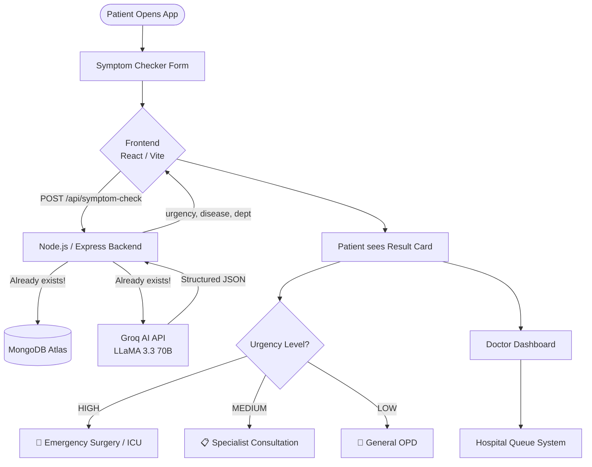

# 🏥 OrvantaHealth — AI Symptom Checker: How It Works

> A deep-dive into the proposed AI-powered triage + symptom analysis feature
> for the OrvantaHealth Hospital Management System.

---

## 🗺️ Big Picture Architecture



---

## 📥 Step 1 — Patient Input (Frontend)

The patient fills out a form with **3 categories of data**:

| Input Category | Fields | Example |
|---------------|--------|---------|
| **Symptoms** | Multi-select checkboxes + free text | Fever, Stomach pain, Vomiting |
| **Vitals** | Numeric inputs | BP: 140/90, Temp: 103°F, SpO2: 95% |
| **Pain Level** | Slider (0–10) | 8/10 |

> **Where this lives in your project:** A new page `SymptomChecker.jsx` in `frontend/src/pages/`

---

## 📡 Step 2 — API Request (Frontend → Backend)

The form POSTs a structured JSON payload to the backend:

```json
POST /api/symptom-check
{
  "symptoms": ["fever", "severe abdominal pain", "nausea"],
  "vitals": {
    "bloodPressure": "130/85",
    "temperature": 103.2,
    "heartRate": 112,
    "oxygenSaturation": 96
  },
  "painLevel": 8,
  "age": 28,
  "gender": "male",
  "duration": "12 hours"
}
```

---

## 🧠 Step 3 — AI Analysis (The Core Logic)

This is where **Groq AI (LLaMA 3.3-70B)** — which **already exists in your project** at `/api/chatbot` — does the heavy lifting.

### How the AI Prompt is Constructed

```javascript
// backend/routes/symptomChecker.js (new file to create)

const systemPrompt = `You are an expert medical triage AI for OrvantaHealth Hospital.
Your job is to analyze patient symptoms, vitals, and pain level and return a structured JSON response.

ALWAYS respond with this exact JSON format:
{
  "urgencyLevel": "HIGH" | "MEDIUM" | "LOW",
  "urgencyReason": "brief explanation",
  "possibleConditions": [
    { "name": "Appendicitis", "probability": "HIGH", "icd10": "K37" },
    { "name": "Gastroenteritis", "probability": "MEDIUM", "icd10": "A09" }
  ],
  "recommendedDepartment": "Emergency Surgery",
  "recommendedAction": "Immediate surgical evaluation needed",
  "warningFlags": ["High fever", "Severe localized pain"],
  "riskScore": 85
}`;
```

### Urgency Decision Logic

```
riskScore 80–100  → RED   → HIGH urgency   → Emergency / ICU
riskScore 50–79   → AMBER → MEDIUM urgency → Specialist OPD  
riskScore 0–49    → GREEN → LOW urgency    → General OPD
```

---

## 📤 Step 4 — AI Response Parsed & Returned

The backend parses the AI's JSON response and returns it to the frontend:

```json
HTTP 200 OK
{
  "success": true,
  "data": {
    "urgencyLevel": "HIGH",
    "urgencyReason": "Severe right lower quadrant pain with fever suggests acute appendicitis",
    "possibleConditions": [
      { "name": "Appendicitis", "probability": "HIGH" },
      { "name": "Ovarian Cyst", "probability": "LOW" }
    ],
    "recommendedDepartment": "Emergency Surgery",
    "recommendedAction": "Proceed to Emergency immediately",
    "riskScore": 89,
    "warningFlags": ["High fever", "Severe localized pain", "High heart rate"]
  }
}
```

---

## 🖥️ Step 5 — Patient Sees Result Card (Frontend)

The result is displayed as a color-coded card:

```
┌─────────────────────────────────────────┐
│  🚨 URGENCY: HIGH                       │
│  Risk Score: 89/100                     │
├─────────────────────────────────────────┤
│  Possible Condition: Appendicitis       │
│  Secondary: Gastritis                   │
├─────────────────────────────────────────┤
│  Recommended Department:                │
│  🏥 Emergency Surgery                  │
├─────────────────────────────────────────┤
│  ⚠️  Warning Flags:                     │
│  • High fever (103°F)                   │
│  • Severe localized pain                │
│  • Elevated heart rate (112 bpm)        │
├─────────────────────────────────────────┤
│  [📋 Book Appointment]  [📞 Call Now]  │
└─────────────────────────────────────────┘
```

---

## 📊 Step 6 — Doctor Dashboard

### What the Doctor Sees

- **Patient Queue** sorted by Risk Score (highest first)
- Color-coded triage badges (RED / AMBER / GREEN)
- Patient symptom summary
- Ability to **confirm** or **override** AI assessment

```
┌──────────────────────────────────────────────────────────┐
│ DOCTOR DASHBOARD — Emergency Surgery                     │
├────────┬──────────────┬──────────┬───────────┬──────────┤
│ Queue  │ Patient      │ Symptoms │ Risk      │ AI Triage│
├────────┼──────────────┼──────────┼───────────┼──────────┤
│  #1    │ Rahul M, 28  │ Abd pain │  89/100   │  🔴 HIGH │
│  #2    │ Priya S, 45  │ Chest    │  72/100   │ 🟡 MED  │
│  #3    │ Amit K, 32   │ Headache │  34/100   │  🟢 LOW  │
└────────┴──────────────┴──────────┴───────────┴──────────┘
```

---

## 🔗 How It Connects to Your Existing Code

| What You Need | What Already Exists | What Needs to be Built |
|---------------|--------------------|-----------------------|
| AI API calls | ✅ `routes/chatbot.js` with Groq (LLaMA 3.3-70B) | New structured prompt + JSON parsing |
| Patient data storage | ✅ `models/Patient.js` | Add `triageHistory[]` field |
| User auth | ✅ JWT middleware in `middleware/auth.js` | Reuse as-is |
| Backend routing | ✅ `server.js` route setup | Add `/api/symptom-check` route |
| Doctor dashboard | ✅ Dashboard pages exist | Add triage queue component |
| Queue management | ✅ Appointments system | Add priority sorting by risk score |

---

## 🧩 Patient Risk Scoring Algorithm

The AI returns a `riskScore` (0–100). Here's how it's calculated by the AI model:

```
riskScore = weighted_sum of:
  - Vital Signs Severity     (30%)  → Abnormal BP, fever, SpO2 drop
  - Symptom Severity         (30%)  → Number, intensity, combination
  - Pain Level               (20%)  → 0–10 scale normalized to 0–20
  - Duration & Progression   (10%)  → Acute vs. chronic
  - Patient Demographics     (10%)  → Age, underlying conditions
```

---

## 🏗️ Files to Create / Modify

```
OrvantaHealth/
├── backend/
│   ├── routes/
│   │   └── symptomChecker.js        ← NEW: AI triage API endpoint
│   ├── models/
│   │   └── TriageRecord.js          ← NEW: Store triage history
│   └── server.js                    ← MODIFY: Add new route
│
└── frontend/src/
    ├── pages/
    │   └── SymptomChecker.jsx       ← NEW: Patient input form + result
    ├── pages/dashboard/
    │   └── TriageQueue.jsx          ← NEW: Doctor triage dashboard
    └── App.jsx                      ← MODIFY: Add routes
```

---

## 🔧 Tech Stack Mapping

| Layer | Technology | Purpose |
|-------|-----------|---------|
| **Frontend** | React + Vite (already exists) | Symptom input form, result display |
| **Backend** | Node.js + Express (already exists) | API routing, AI orchestration |
| **Database** | MongoDB Atlas (already exists) | Store triage records, patient history |
| **AI Engine** | Groq API / LLaMA 3.3-70B (already exists) | Medical analysis, risk scoring |
| **Auth** | JWT (already exists) | Protect doctor dashboard |

---

## ✅ Summary Flow

```
Patient fills form
      ↓
[Symptoms + Vitals + Pain Level]
      ↓
POST /api/symptom-check
      ↓
Backend constructs structured medical prompt
      ↓
Groq AI (LLaMA 70B) analyzes data
      ↓
AI returns urgency + disease + department as JSON
      ↓
Backend validates + stores triage record in MongoDB
      ↓
Frontend renders result card with color-coded urgency
      ↓
Doctor dashboard shows patient queue sorted by risk score
      ↓
Doctor confirms / books appointment / escalates to emergency
```

---

> **Good news:** Your project already has ~70% of the infrastructure needed.
> The AI key, database, auth system, and backend routes are all in place.
> You mainly need the **new symptom checker endpoint** + **frontend pages**.
